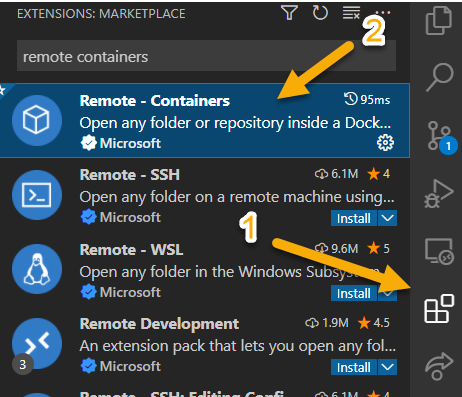
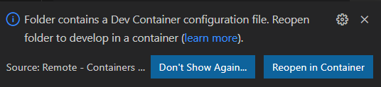
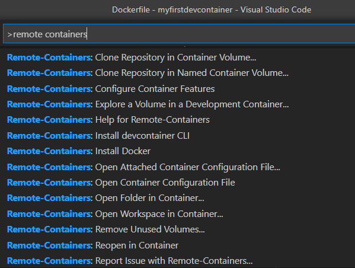
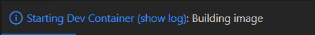

# DataTalks.club Data Engineer ZoomCamp Notes

## Table of Contents

- [About](#about)
- [Getting Started](#getting_started)
- [Usage](#usage)

## About <a name = "about"></a>

This repo contains code and notes for the 2023 cohort [DE ZoomCamp](https://github.com/DataTalksClub/data-engineering-zoomcamp/tree/main/cohorts/2023)

The [.devcontainer](.devcontainer/devcontainer.json) directory has configuration to create a VS Code Dev Container, with preset features for Cloud and DE type tasks. This should be automatically detected by Visual Studio Code, alerting you to reload in a remote container.

---
## Included Features

**Official Dev Containers Features (devcontainer.json)**
- aws-cli:1
- docker-in-docker:2
- terraform:1": { "installTerraformDocs": true },
- google-cloud-cli:1": {},
- python:1": { "installJupyterlab": true }

**Features loaded with PyPI (pip install -r requirements.txt)**
- pgcli
- docker-compose
- pandas
- sqlalchemy
- psycopg2-binary

---


# Getting Started <a name = "getting_started"></a>

These instructions will get you a copy of the project up and running on your local machine for development and testing purposes. See [deployment](#deployment) for notes on how to deploy the project on a live system.

## Prerequisites

What things you need to install the software and how to install them.

```
A computer running either Linux, macOS or Windows
Docker Desktop
Visual Studio Code
```

# Installing

A step by step series of examples that tell you how to get a development env running.

(Steps taken from: https://www.powershell.no/vscode,/docker,/containers,/productivity,/powershell/2022/01/31/how-to-get-started-with-vs-code-dev-containers.html See full details on working with dev containers at this link.)

## Step 1 — Install the Visual Studio Code Remote - Containers extension

The first thing we are going to do after installing the prerequisites is to install the VS Code Remote - Containers extension.

Open VS Code and navigate to the Extensions item in the sidebar. Next, search for “remote containers”:




Click on “Remote - Containers” and click the Install button which becomes available after clicking on the button.

**Tip:** *Alternatively, you may install the “Remote Development” extension pack at the bottom of the above screenshot. This contains the “Remote - Containers” extension as well as two other very useful extensions: “Remote SSH” for connecting to remote SSH targets as well as “Remote - WSL” which makes it very convenient to work with the Windows Subsystem for Linux from VS Code on Windows.*

## Step 2 - Edit Environment Variables

**WARNING: DO NOT COMMIT CREDENTIALS TO YOUR REPOS!!!**

(devcontainer.env is already included in .gitignore, so this file will need to be created from the given sample)
[devcontainer.env](.devcontainer/devcontainer.env) allows you to configure access keys, etc. for AWS CLI or other CLI tooling.
    
    Example:
    -   Use a specific AWS IAM user with least privilege security principals - giving only the necessary access permissions. Generate and use the provided access keys for this user and add the details to the .env file.


## Step 3 - Open the configured dev container
When VS Code detects the devcontainer configuration files at the root of a folder, it will prompt whether we want to “Reopen in Container”:




Should the “Remote - Containers” extension not be installed, you will be prompted to install it.

An alternative approach to reopen the current folder inside the dev container is to once again open the Command pallette An alternative approach to reopen the current folder inside the dev container is to once again open the Command pallette and Edit 

ontainers. Next, select “Reopen in Container”: search for Remote Containers. Next, select “Reopen in Container”:



VS Code will now reopen and the following status will be shown:




Under the hood, the command docker build is now being run using the specified docker image. This will result in a local container image becoming available on our machine.

The build step might take from a few seconds until a few minutes depending upon the size of the base image we chose, the number of tools to install, the bandwidth of our internet connection as well as the performance of the local machine.

**NOTE:** *Because of the curated list of features for this use case, the initial build time does take a few minutes to complete.*


The build step is only needed whenever a change has been made to the configuration files for the development container, so the next time you open the folder inside the dev container, it will typically open in seconds - similar to when opening a regular local folder.


# Usage <a name = "usage"></a>

1. Use VS Code to manage your code files and for text editing purposes. 
2. Use VS Code's integrated terminal to execute CLI related tasks. (CTRL + ` )

try some commands to check versions


```
$ python --version

$ git --version    
```

